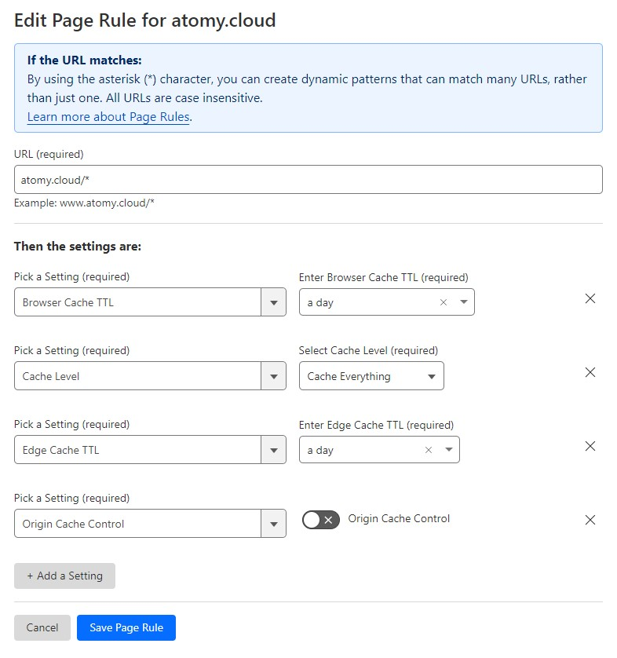

# Caching Static HTML with WordPress/WooCommerce

## Overview


Customers in all Cloudflare plans can configure caching HTML files. However, Business and Enterprise customers can bypass HTML caching when a cookie is sent with a request *Bypass Cache on Cookie* setting using Cloudflare Page Rules.


This allows for static HTML to be cached at our edge, with no need for it to be regenerated from request to request. 

Enterprise Cloudflare customers can use _Custom Cache Keys_ to take their performance further, contact your Customer Success Manager for more details.

___

## Prerequisites

Before starting - be sure that Cloudflare is set to respect _Cache-Control_ headers from your origin web server; otherwise, you may find _Cache-Control_ headers are overridden by Cloudflare with the value set in the **Browser Cache TTL** option. To set the _Respect Existing Headers_ option,

1.  Log into your Cloudflare account.
2.  Click the **Caching** app.
3.  Scroll down to **Browser Cache TTL**, and select the _Respect Existing Headers_ value.

___

## Cache Static HTML with Cloudflare Page Rules

1\. Log in to your Cloudflare account.

2\. Go to **Rules >** **Page Rules** and select **Create Page Rule**.

3\. Set the page rule to match your WordPress installation path. If your site is at https://www.example.com, the rule would be [https://www.example.com.](https://www.example.com./)

4\. Select the appropriate settings to cache static HTML:

-   _Cache Everything_ instructs Cloudflare to cache static HTML.
-   When the _Bypass Cache on Cookie_ rule matches the criteria you set, Cloudflare won't cache HTML ([though static images and other files will still be cached](/cache/concepts/default-cache-behavior/)). Depending on whether you're using raw WordPress, or WooCommerce, you should use one of the configurations below:



| WordPress type | Cookie configuration |
|---|---|
| WordPress (native) | wp-.\*\|wordpress.\*\|comment\_.\* |
| WordPress with WooCommerce | wp-.\*\|wordpress.\*\|comment\_.\*\|woocommerce\_.\* |



-   Finally, setting _Edge Cache TTL_ will define the maximum period of time Cloudflare should keep cached files before getting them back from the origin web server. Even after setting a long Edge Cache TTL time, you can still [manually clear the cache](https://support.cloudflare.com/hc/en-us/articles/200169246-How-do-I-purge-my-cache-) or use our WordPress plugin to automatically manage cache purging.

5\. Click **Save and Deploy** to finish. 

Additionally, by using the [_Automatic Cache Management_ feature of the Cloudflare WordPress plugin](https://support.cloudflare.com/hc/en-us/articles/115002708027-What-does-Automatic-Cache-Management-in-the-Cloudflare-Plugin-do-), you are able to automatically purge the cache for your site after your site changes (i.e. changing/customizing your theme or editing, deleting or creating a post, attachment or page).
